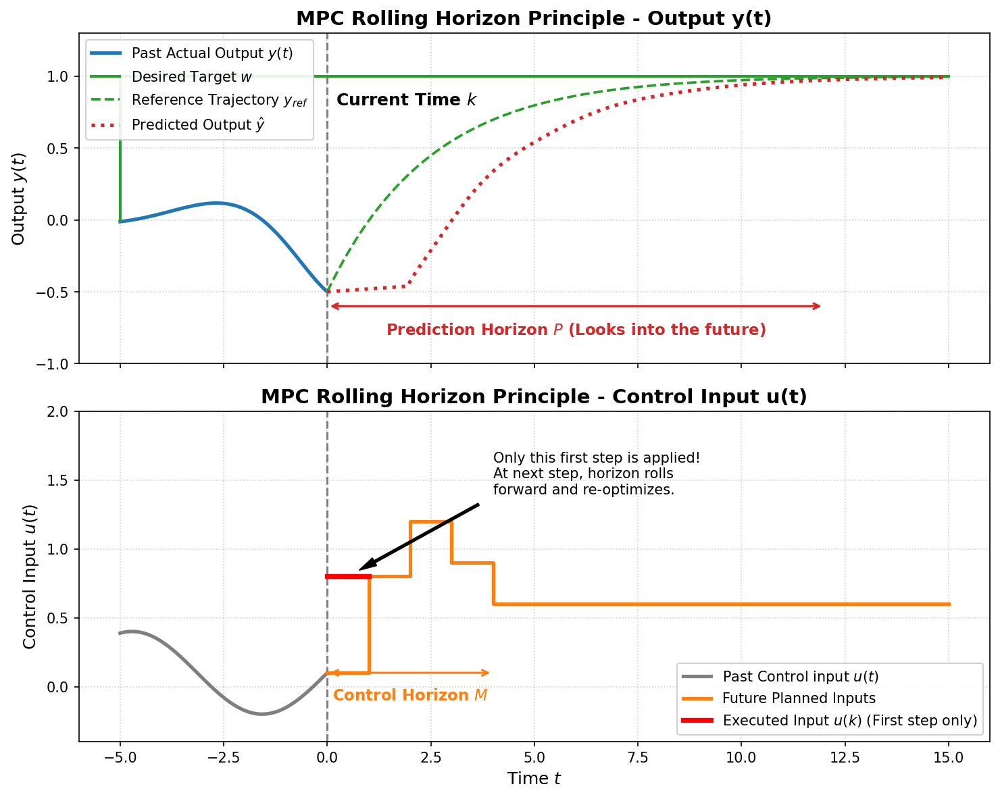
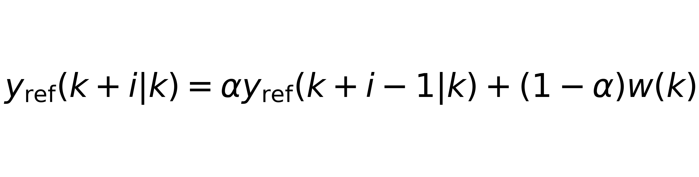
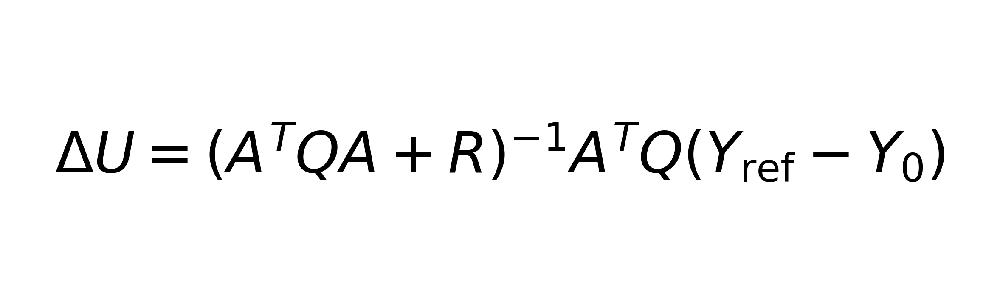
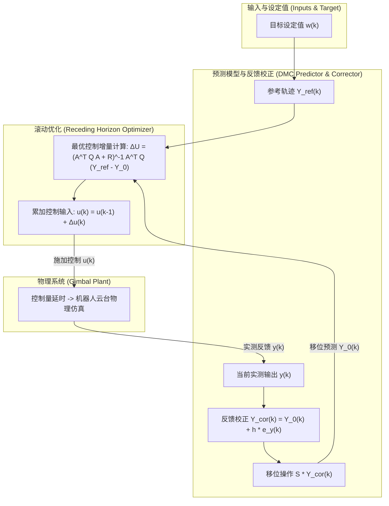
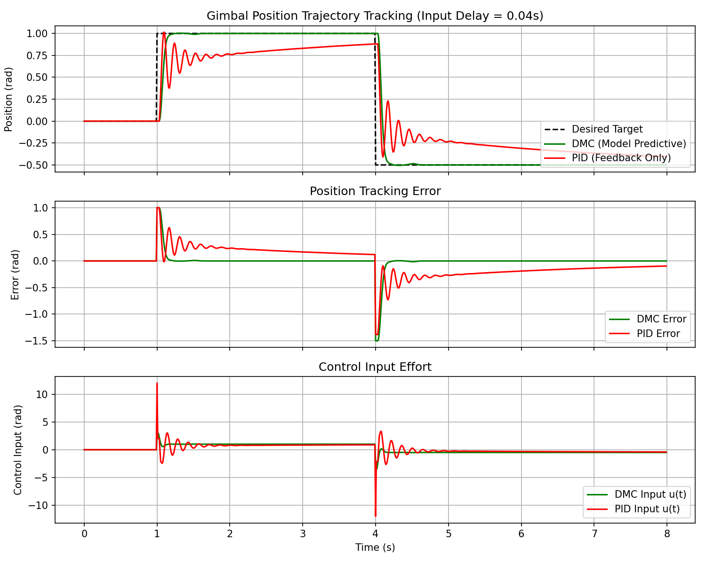

# Robot Learning 教程：模型预测控制 (Model Predictive Control) 与动态矩阵控制 (Dynamic Matrix Control)

本章重点讲解在机器人控制领域广泛应用的 **模型预测控制 (Model Predictive Control, MPC)** 算法，并结合 Gitee 上的开源云台控制项目 [clangwu/mpc_control](https://gitee.com/clangwu/mpc_control)，剖析其核心子类——**动态矩阵控制 (Dynamic Matrix Control, DMC)** 算法。

我们将通过生动的比喻、数学公式推导、控制器架构框图（Mermaid 流程图）以及 Python 物理仿真实验，深入对比经典 PID 控制与模型预测控制 (DMC) 在具有 **纯输入延时 (Input Delay)** 的机器人云台轨迹跟踪任务中的性能差异。

---

## 1. 模型预测控制 (MPC) 与动态矩阵控制 (DMC) 概述

为了让大家彻底搞懂预测控制的精髓，我们先抛开枯燥的数学公式，用一个生活中的**“开车比喻”**来理解它的核心逻辑。

### 1.1 一个直观的比喻：如何驾驶一辆“转向延时”的赛车？

假设你正在驾驶一辆赛车，但这辆赛车有一个致命的缺陷：**转向机构有 1 秒的延迟**。也就是说，你现在转动方向盘，赛车在 1 秒钟之后才会真正开始拐弯。

* **如果使用 PID（纯反馈控制）**：
  PID 属于“被动反应式”控制，它只看着眼前的车道中心线（当前误差）。
  - 当车道开始向右弯曲时，赛车偏左了，PID 发现误差，立刻向右猛打方向盘。
  - 由于 1 秒延时，赛车在接下来的 1 秒内依然直行。PID 慌了：“怎么没反应？肯定是我方向盘打得不够！” 于是继续往右打。
  - 1 秒钟后，延迟结束，车轮突然疯狂向右偏转，赛车瞬间冲出右侧跑道！
  - PID 赶紧往左猛打方向盘…… 结果就是赛车在跑道上剧烈蛇行、画龙，直至彻底失控。

* **如果使用 MPC（预测+滚动优化）**：
  MPC 属于“主动前瞻式”控制，它不仅看眼前，还会看着前方一段距离的道路曲线（**预测时域 *P***）。
  - 赛车内部拥有一个车辆运动学模型，它非常清楚：“我的转向有 1秒延迟”。
  - 当看到前方 2 秒后有一个右弯时，控制器会利用模型进行计算，**提前 1 秒**开始向右转动方向盘。
  - 它会规划未来几步的方向盘转角序列（**控制时域 *M***），以保证赛车正好沿着弯道曲线行驶。
  - 在当前时刻，它只执行规划的第一步动作。到了下一个采样时刻，它重新测一下赛车的实际位置，将预测区间向前挪一步（**滚动移位**），重新计算。
  - 结果：赛车能够极度平顺地过弯，完全消除了延时带来的负面影响。

### 1.2 MPC 的三大基石
模型预测控制的核心由以下三部分组成：
1. **预测模型 (Predictive Model)**：机器人的“虚拟替身”。根据历史数据和未来的控制规划，预测未来 *P* 个时刻内系统的状态走向。
2. **滚动优化 (Receding Horizon Optimization)**：机器人的“智囊团”。通过求解一个二次型目标函数，规划出未来 *M* 步的最优控制指令序列。在当前步**只执行第一步**。
3. **反馈校正 (Feedback Correction)**：机器人的“眼和耳”。每次滚动时，用传感器的真实测量值修正预测模型的偏差，防止累积误差。

### 1.3 什么是 DMC？
**动态矩阵控制 (DMC)** 是工业界最经典、应用最广泛的一种线性 MPC 算法。它直接采用系统的 **阶跃响应 (Step Response)** 作为预测模型：
- **无需解析方程**：只要对物理系统（如云台电机）施加一个阶跃电压，记录输出位置的曲线，这组曲线数据就是我们的模型。
- **天然包容延时**：如果系统有纯时滞，阶跃响应的前几项就会自然为 0，DMC 的动态矩阵会自动学到这一特征并进行精准的延时补偿。

---

## 2. 动态矩阵控制 (DMC) 算法数学原理

DMC 的求解过程可以非常完美地用以下两幅图表来解释：

### 2.1 滚动优化原理示意图

下图展示了在当前时刻 *k*，预测时域 *P* 和控制时域 *M* 是如何随着时间向前滚动、规划以及实施的：

  

### 2.2 预测模型与动态矩阵
假设系统在单位阶跃输入下，各个采样时刻的输出响应值为 *a*1, *a*2, ..., *a**P*。
在时刻 *k*，预测时域为 *P*，控制时域为 *M*（其中 *M* ≤ *P*）。由于控制量增量 *dU* 产生的系统预测输出向量与自由响应向量 *Y*0(*k*) 之间满足以下预测模型：

其中，动态矩阵 *A* 描述了控制增量对未来预测输出的映射关系。它是一个下三角矩阵：

### 2.3 参考轨迹 (Reference Trajectory)
为了平滑地跟踪设定值 *w*(*k*)，DMC 采用指数平滑滤波因子 *α*（0 ≤ *α* < 1）规划参考轨迹：

### 2.4 反馈校正与滚动移位
由于环境存在风阻、摩擦或建模误差，真实的测量输出 *y*(*k*) 会偏离预测。我们引入校正向量 *h*（元素通常为 0 到 1 之间的平滑常数，如 0.5）来修正预测：

校正后的未来预测向量在进入下一个采样时刻时，需要通过一个移位算子 *S* 进行左移操作，丢弃已发生的一步，并在末尾复制最后一项：

### 2.5 二次型优化求解
DMC 的目标是让预测输出尽可能贴近参考轨迹，同时避免控制输入变化太剧烈。其优化目标函数为：

其中，*Q* 为误差权重，*R* 为控制变化率惩罚。对其求导并令其为 0，可以得到**无约束情况下的解析最优解**（在代码中可以进行预计算以极大提高运算速度）：

在当前步，我们只执行解出的第一个控制增量，并累加到实际控制输出中：

---

## 3. 云台系统物理建模与延时挑战

### 3.1 仿真背景：机器人云台控制任务
在许多机器人实际应用场景中（例如 **RoboMaster 自主对决机器人**、**手持相机防抖云台** 以及 **车载雷达稳定转台**），我们需要控制一个多轴云台，使镜头或传感器快速、高精度地对准并锁定目标。
* **物理对象**：这里 we 仿真研究云台的单轴（例如偏航轴 Yaw）角度控制。云台由直流伺服电机通过减速机构驱动。
* **控制任务**：角度轨迹跟踪与目标快速切换。当系统的目标角（比如通过上位机视觉算法识别出的动态靶标或装甲板坐标）发生突变时，云台需在极短时间内偏转到新角度，且要求**无超调**（防止视野晃动导致图像脱锁）和**无低频抖动**。

### 3.2 系统中纯时滞 (Pure Time Delay) 的物理来源
在真实的机器人闭环控制系统中，从“摄像头看到目标”到“电机做出转动反应”之间，存在无法避免的物理延时。延时主要来源于以下几个关键环节：
1. **传感器曝光与数据传输**（约 10ms - 15ms）：相机传感器捕获图像并将其传输至微型计算机（如 NVIDIA Jetson 或 PC）。
2. **算法处理与目标检测**（约 10ms - 20ms）：计算机利用深度学习网络（如 YOLO 目标检测器）处理图像并求解目标三维空间角度。
3. **网络与现场总线通信**（约 5ms）：计算机将控制指令通过串口或 CAN 总线下发至云台主控 MCU。
4. **控制量反馈与电机绕组延迟**（约 5ms）：MCU 对控制电压进行电流环调制，电机绕组建立电磁转矩也存在物理延迟。
这些延迟累加起来，在我们的仿真中模拟为 *L* = 0.04s（40 毫秒）的**输入纯时滞**。在 100 Hz 控制回路下，这相当于整整 4 个采样周期的“无响应真空期”。也就是说，控制器在时刻 *t* 做出的控制决定，电机在 *t* + 0.04s 才开始真正执行。

### 3.3 传递函数与状态空间模型
我们将云台闭环伺服位置系统建模为受输入延时约束的典型二阶系统。云台的连续传递函数可写为：

其中，*θ* 为云台实际倾角，*θ**d* 为控制器下发的期望目标位置指令。*ω**n* 为系统固有角频率（表征响应速度），*ζ* 为阻尼比（表征系统阻尼特性），*L* 为通信与信号链路带来的纯时滞。
将其转换为状态空间方程（设定状态变量 *x*1 = *θ*, *x*2 = *θ̇*）可写为：

### 3.4 仿真运行平台与效果演示视频
为了兼顾“开箱即用”的学习体验与“真实复杂”的机器人系统开发，本教程提供双层仿真平台支持：
1. **轻量级 Python 数值仿真平台**：本模块自带。基于 NumPy 实现了云台时滞二阶动力学方程的 RK4 数值积分器，运行即可在终端快速验证算法数学模型，生成并保存 [trajectory_comparison.png](trajectory_comparison.png) 图表。
2. **3D 物理引擎仿真平台 (CoppeliaSim/V-REP)**：Gitee 原项目采用的平台。利用 CoppeliaSim 物理引擎建立机器人三维动力学模型，通过 Remote API 进行 C++/Python 与 3D 虚拟世界的实时双向控制。
3. **真实控制过程演示视频**：
   - 🎬 [云台控制效果演示视频 (Bilibili)](https://www.bilibili.com/video/BV1U54y1J7wh)：展示了 3D 物理引擎中，云台在使用 MPC/DMC 控制与 PID 控制下的目标跟踪物理表现对比。
   - 🛠️ [如何配置与运行 CoppeliaSim 仿真项目 (Bilibili)](https://www.bilibili.com/video/BV1KL4y1B7yn)：详细讲解了 3D 物理仿真环境 the 搭建、配置及运行方法。

---

## 4. 动态矩阵控制 (DMC) 结构框图

以下为 DMC 的闭环反馈控制流图。通过此图可以清晰地看出传感器反馈值是如何修正未来的模型预测的：

---

## 5. Python 代码与仿真说明

本工程在当前路径下提供了以下两个 Python 实现文件：
1. **[mpc_controller.py](mpc_controller.py)**：
   - 实现了基于二次型优化求解的工业 `DMCController`。
   - 自动生成移位矩阵 *S*，并在后台预先计算高维伪逆矩阵以提升控制器实时性能。
2. **[simulation.py](simulation.py)**：
   - 构建了具有输入延时 *L* = 0.04s（在采样周期 *Δt* = 0.01s 下相当于 4 步延迟）的闭环二阶云台物理仿真类 `StableGimbalSim`，使用第四阶龙格-库塔 (`rk4_step`) 进行连续物理模拟。
   - 运行 open-loop 单位阶跃响应测试，自动为控制器获取阶跃响应系数 *a**i*。
   - 在多步跃变目标轨迹下，对比具有输入延时的云台系统在 **PID 控制** 与 **动态矩阵控制 (DMC)** 下的位置跟踪响应、控制输入与误差表现。
   - 绘制对比曲线并自动保存为 `trajectory_comparison.png`。

### 5.1 仿真结果对比与深度分析

运行 `simulation.py` 后生成的对比图如下：

#### 重点结果指标分析：
1. **跟踪精度与系统超调**：
   - **PID 控制器**（红色曲线）：由于受到 0.04s 纯时滞的影响，即使经过精细调参，位置波形在目标变化时刻依然出现了明显的抖振和超调（超调量约为 16%），且收敛缓慢。如果尝试将比例系数 *K**p* 继续调大，系统会由于正反馈积累立刻陷入严重的自激发散振荡。
   - **动态矩阵控制 DMC**（绿色曲线）：在目标突变后表现极其稳健。不仅实现了极速响应，而且在过渡后直接切入 0 超调状态并紧紧锁定了设定值。这证明了 DMC 具有卓越的滚动优化与时滞预测能力。
2. **控制输入（控制指令曲线）**：
   - **PID 控制器** 的输出指令在设定值跃变时刻表现出剧烈的波动与高频抖动，这会导致真实的伺服电机由于高频换向产生发热甚至损坏。
   - **DMC 预测控制器** 表现出的控制输出极其平缓、合理。它不仅能在阶跃开始前通过模型预测“有计划地”调整能量，而且在接近设定值时能提前减小动作，有效消除了伺服机构受到的物理冲击。

---

## 6. 总结与后续

动态矩阵控制 (DMC) 很好地诠释了通过“已知模型预测未来”以摆摆脱传统负反馈时滞限制的核心思路。在控制理论的发展史中，MPC 的出现架起了从“无模型 PID”到“模型驱动现代控制”的坚实桥梁。

在后续章节中，我们将探索当模型变得非线性、状态难以完全获取时，如何结合现代强化学习技术，使用 **深度强化学习控制 (DRL)** 在更复杂的机器人交互场景下进行端到端的灵巧运动控制。
