# Robot Learning 教程：PID 控制与计算力矩控制 (Computed Torque Control)

本章作为 Robot Learning 教程的起点，重点讲解经典的 **PID 控制** 以及其在多自由度机器人动力学控制中的延伸版本——**计算力矩控制 (Computed Torque Control, CTC)**。

我们将通过数学公式推导、控制器架构框图（Mermaid 流程图及本地 SVG）以及 Python 物理仿真实验，深入对比非模型控制（独立关节 PID）与模型控制（计算力矩控制）在多关节机械臂轨迹跟踪任务中的性能差异。

---

## 1. 经典 PID 控制算法

### 1.1 算法原理
PID 控制器（比例-积分-微分控制器）是一种广泛应用于工业控制的闭环反馈算法。其控制输出 *u(t)* 基于系统设定值与当前测量值之间的偏差 *e(t) = y_d(t) - y(t)* 计算得出。其连续形式公式如下：

  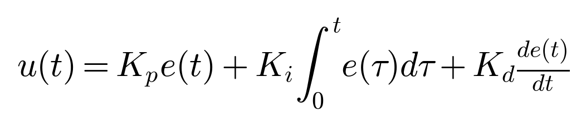

其中：
- **比例项 (Kp)**：根据当前误差的大小按比例调整输出，起主要纠偏作用。
- **积分项 (Ki)**：消除静态误差（稳态误差），但容易引起系统超调及积分饱和 (Windup)。
- **微分项 (Kd)**：根据误差的变化趋势预测未来动作，提供阻尼以减少超调，稳定系统。

### 1.2 PID 结构框图
以下是标准的 PID 控制系统闭环反馈结构图：

  

### 1.3 独立关节 PID 在机器人控制中的缺陷
在机器人运动控制中，若直接对每个关节应用独立的单输入单输出 (SISO) PID 控制，会面临巨大挑战：
- **关节强耦合**：机械臂运动时，某一关节 of 转动会对其他关节产生反作用力（惯性耦合）。
- **非线性重力矩**：随关节角度变化，机械臂受到的重力矩是非线性的，单靠积分项很难实时补偿快速变化的重力矩。
- **科氏力与离心力**：当关节速度较快时，非线性力项 *C(q, dq/dt) dq/dt* 增大，导致 PID 跟踪产生显著滞后。

---

## 2. 机器人动力学建模

为了解决上述问题，我们需要引入机械臂的动力学模型。对于一个 *n* 自由度刚性机械臂，其多体动力学方程通常采用欧拉-拉格朗日法推导得到：

  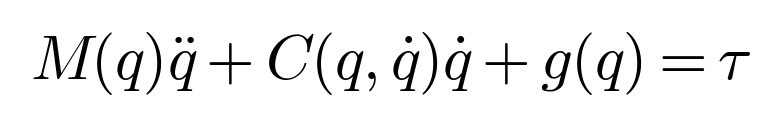

其中：
- *q*, *dq/dt*, *d²q/dt²*：关节位置、速度和加速度向量。
- *M(q)*：关节惯性矩阵，它是对称的正定矩阵，代表系统在当前姿态下的惯量阻抗。
- *C(q, dq/dt)*：科氏力 (Coriolis) 与离心力 (Centrifugal) 矩阵。
- *g(q)*：重力矩向量。
- *tau*：各关节输入的控制力矩向量。

在我们的仿真例程中，我们使用了一个垂直平面内的 **2-DOF 平稳双关节机械臂 (2-Link RR Manipulator)**，其惯性、科氏力和重力矩矩阵有如下精确的解析表达式：

- **惯性矩阵 *M(q)*** 的各项元素：
  

    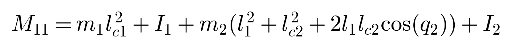 
    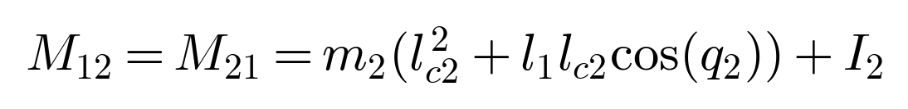 
    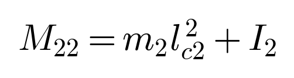
  

- **科氏力/离心力矩阵 *C(q, dq/dt)*** 的各项元素：
  

    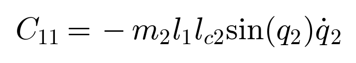 
    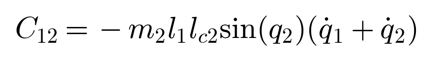 
    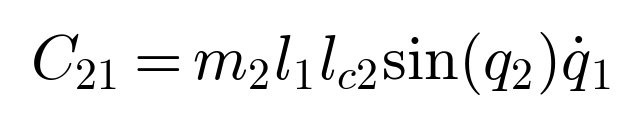 
    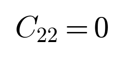
  

- **重力矩向量 *g(q)*** 的各项元素：
  

    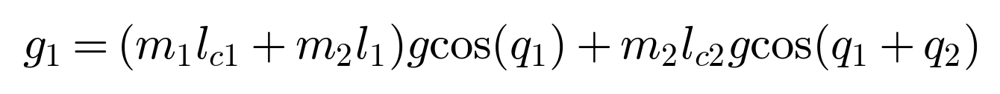 
    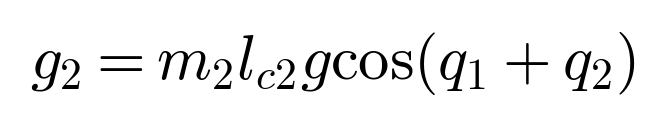
  

---

## 3. 计算力矩控制 (Computed Torque Control)

**计算力矩控制 (CTC)**，也被称为反馈线性化 (Feedback Linearization) 控制。其思想是利用已知的动力学模型计算出可以刚好抵消非线性力（重力、科氏力）的力矩，从而把复杂的非线性、多变量耦合系统化简为简单的解耦二阶线性系统。

### 3.1 控制律推导
设期望轨迹为 *q_d(t)*，实际关节角为 *q(t)*。定义跟踪误差和误差变化率分别为：

  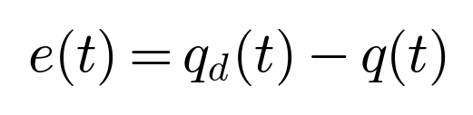&nbsp;&nbsp;&nbsp;&nbsp;&nbsp;&nbsp;&nbsp;&nbsp;
  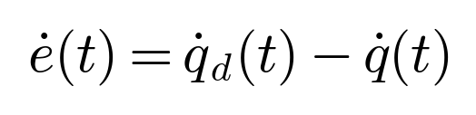

我们设计控制力矩为：

  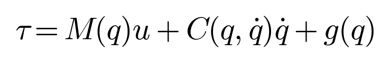

其中 *u* 为辅助控制输入。将控制力矩带入机械臂动力学方程，由于惯性矩阵 *M(q)* 是正定的、可逆的，化简可得：

  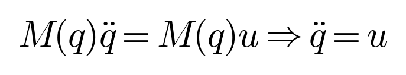

通过反馈线性化，系统的输入输出关系退化为极其完美的二阶解耦积分器！

### 3.2 引入外部 PID 反馈回路
我们为退化后的二阶系统设计带有前馈的 PID 控制律：

  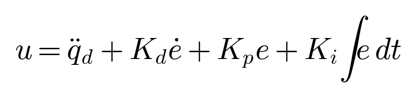

代入系统方程并整理，可以得到闭环误差传递方程：

  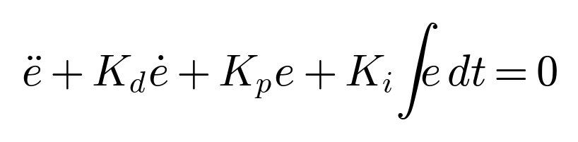

通过合理调整正定对角增益矩阵 **Kp**、**Kd** 和 **Ki**，我们可以将闭环误差系统配置为期望的极点位置（如临界阻抗状态），保证跟踪误差渐近收敛至零。

### 3.3 计算力矩控制框图

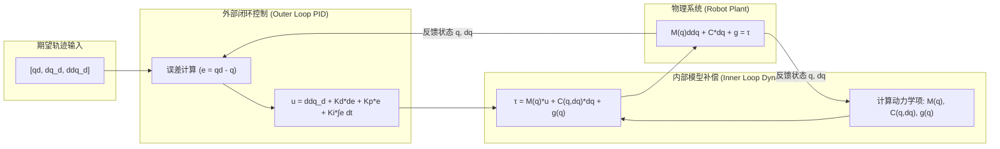

---

## 4. Python 代码与仿真说明

本工程在当前路径下提供了以下两个 Python 实现文件：
1. **[pid_controller.py](pid_controller.py)**：
   - 实现了带饱和限幅的单变量 `PIDController`。
   - 实现了 2-DOF 动力学模拟类 `TwoLinkRobot`，通过 `get_dynamics_matrices` 计算质量矩阵、科氏力与重力矩，并提供第四阶龙格-库塔 (`rk4_step`) 积分方法用于离散物理模拟。
   - 实现了基于矩阵运算的多变量 `ComputedTorqueController`。
2. **[simulation.py](simulation.py)**：
   - 设定期望轨迹：$q_1 = \sin(t)$，$q_2 = \cos(2t)$。
   - 分别运行**单关节独立 PID 控制**和**计算力矩控制**对机械臂实施轨迹跟踪，时间步长 *dt* = 2ms，共模拟 10s。
   - 最终绘制位置跟踪、跟踪误差以及各关节力矩变化情况 of 对比曲线，并自动保存到 `trajectory_comparison.png` 中。

### 4.1 仿真结果对比与深度分析

运行 `simulation.py` 后生成的对比图如下：

#### 重点结果指标分析：
1. **跟踪精度（位置与误差曲线）**：
   - **独立关节 PID**（红色曲线）：由于重力和非线性惯性力不断改变，独立关节 PID 表现出明显的相位滞后，并在部分区域出现不可消除的动态跟踪误差。
   - **计算力矩控制 CTC**（绿色曲线）：快速收敛至期望轨迹，且跟踪误差在过渡过程后紧紧逼近 0 刻度线。这是因为 CTC 对系统的惯量变化和重力项进行了完整的正向补偿。
2. **控制输入（力矩曲线）**：
   - 关节 1 的控制力矩变化明显要比关节 2 更剧烈且数值更大，这非常符合物理实际（关节 1 需要承载整个臂以及关节 2 的所有重量和转动惯量）。
   - CTC 计算出的力矩曲线比纯 PID 控制更加平滑和合理，有效消除了传统大增益 PID 控制器可能导致的力矩抖振现象。

---

## 5. 总结

在经典机器人控制理论中，计算力矩控制 (CTC) 代表了“模型驱动控制”的经典范式。本节通过对比，向大家展示了引入“动力学先验”对于提高复杂机械臂控制精度的显著价值。这为我们在后续章节中学习**模型预测控制 (MPC)** 和结合深度学习的**强化学习控制 (DRL)** 奠定了扎实的多体物理系统基础。
