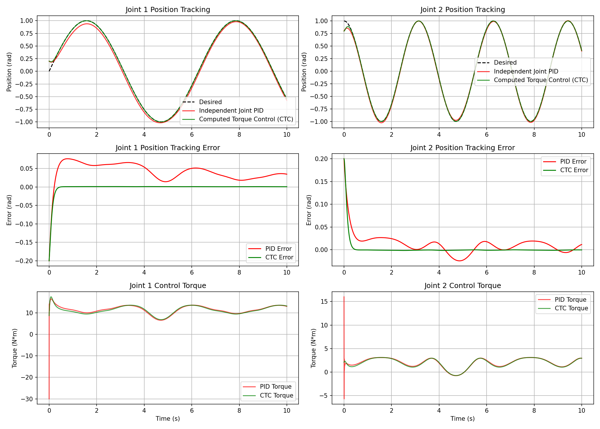

# Robot Learning Tutorial

欢迎来到 **Robot Learning 基础与进阶控制算法教程**！本仓库致力于构建一个体系完整、理论扎实且配有保姆级仿真的机器人控制与学习算法实践项目。

我们为每个控制/学习分支建立独立的模块，包含**详细的数学推导 README**、**从零手写的核心控制器 Python 实现**以及**直观的可视化物理仿真脚本**。

---

## 🛠️ 项目导航与分支结构

每个子目录下均包含：
1. **README.md**：详尽的控制/学习算法数学推导、系统模型分析及控制框图。
2. **控制器源码 (Python)**：从底层零依赖实现的控制器类。
3. **仿真与对比脚本 (Python)**：动力学或运动学环境的离散模拟，以及对比曲线生成（自动保存为 PNG 结果图）。

### 📂 子分支目录

| 章节名称 | 控制/学习理论模型 | 物理仿真对象 | 状态与成果 |
| :--- | :--- | :--- | :--- |
| 1. [PID Control](PID/README.md) | 独立关节 PID 控制 与 计算力矩控制 (Computed Torque Control, CTC) | 2-DOF 垂直双关节机械臂 (2-Link RR Manipulator) | ✅ 已完结 (位置跟踪与模型补偿对比) |
| 2. [Model Predictive Control (MPC)](MPC/README.md) | 动态矩阵控制 (Dynamic Matrix Control, DMC) | 具有纯时滞的机器人高频防抖云台 (Gimbal Axis with Delay) | ✅ 已完结 (时滞补偿对比与分析) |
| 3. Deep Reinforcement Learning (DRL) | 深度强化学习控制算法 (e.g. DDPG, SAC) | 待规划 | 📅 待开发 |
| 4. Imitation Learning (IL) | 模仿学习与行为克隆 (Behavior Cloning) | 待规划 | 📅 待开发 |

---

## 🚀 快速上手说明

### 1. 运行环境配置
项目均采用纯 Python (基于 NumPy, Matplotlib) 开发，推荐使用 Python 3.8+ 环境。您可以通过以下命令安装核心依赖：
```bash
pip install numpy matplotlib
```

### 2. 运行仿真验证
* **运行 PID 分支仿真**：
  ```bash
  cd PID
  python simulation.py
  ```
  运行结束后会在 `PID/` 下生成轨迹对比图 `trajectory_comparison.png`。

* **运行 MPC/DMC 分支仿真**：
  ```bash
  cd MPC
  python simulation.py
  ```
  运行结束后会在 `MPC/` 下生成时滞云台跟踪对比图 `trajectory_comparison.png`。

---

## 📈 项目效果预览

### PID 关节耦合控制 vs 计算力矩控制 (CTC)
通过引入动力学惯性矩阵与非线性力补偿，CTC 控制器（绿色）相比独立 PID 控制（红色）几乎消除了运动强耦合带来的动态相位滞后。
<p align="center">
  
</p>

### PID 延时抖振 vs 动态矩阵控制 (DMC)
在 0.04s 纯通信延时下，传统 PID（红色）极易产生严重的相位滞后和超调振荡；而 DMC 预测控制器（绿色）能够完美前瞻未来的延时响应，实现极速无超调平滑跟踪。
<p align="center">
  
</p>

---

## 📌 项目开发规范 (AGENTS.md)
为保证本仓库在各大在线托管平台 (GitHub/Gitee) 上具备完美的公式和图表渲染表现，编写教程时必须遵循以下规范：
1. **公式本地预编译**：不要直接写 LaTeX 块 `$$ ... $$`，一律使用 matplotlib 预编译至对应目录下的 `images/eq_*.png` 并通过 HTML `` 标签引用。
2. **行内变量无符号**：避免使用 `$ ... $` 渲染行内变量，统一使用 markdown 加粗或斜体（例如 **K_p**，*tau*）。
3. **Mermaid 规范**：子图名若带括号 `( )` 必须用双引号包裹，如 `subgraph "Name (Detail)"` 以免解析引擎报错。