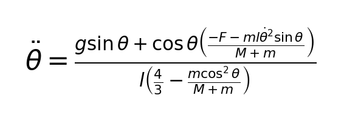
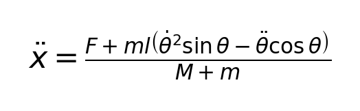
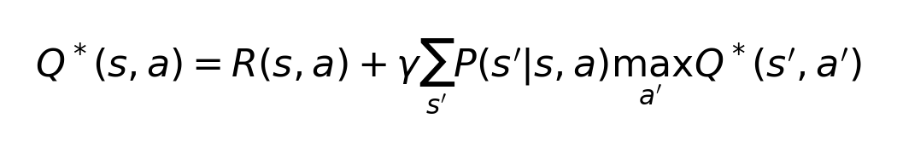
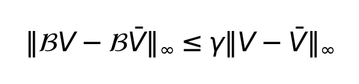
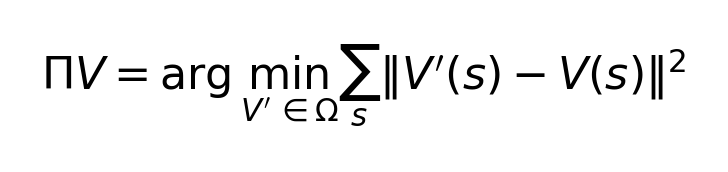
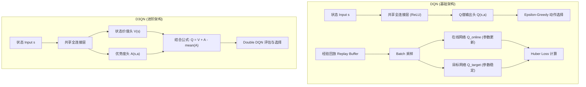
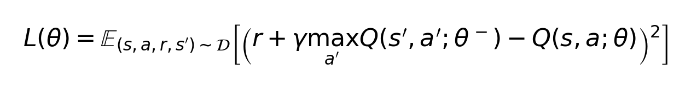
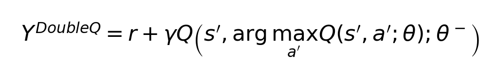
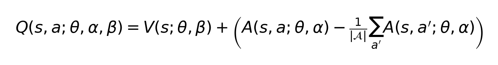
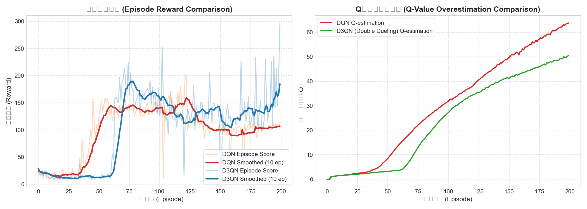

# Value-Based DRL: DQN 与 Double Dueling DQN (D3QN) 倒立摆控制

本章节致力于展示基于值函数（Value-Based）的深度强化学习（DRL）算法，并应用于经典的物理控制任务 —— **小车倒立摆 (Cart-Pole)**。

我们从马尔可夫决策过程（MDP）出发，深入探讨最优贝尔曼方程、值迭代的收敛性（收缩映射定理）、拟合值迭代（FQI）的散敛性，并手写 PyTorch 代码实现 **DQN** 与 **Double Dueling DQN (D3QN)**，通过对比实验直观地展示 **Q值过估偏差 (Q-Value Overestimation Bias)** 及其解决机制。

---

## 1. 物理背景与直观阐释

### 1.1 什么是小车倒立摆？
**小车倒立摆 (Cart-Pole)** 是控制理论与强化学习领域的“Hello World”级基准。系统由一个可以在一维无摩擦轨道上水平移动的小车，以及一个通过自由转动铰链连接在小车顶部的摆杆组成。
*   **控制目标**：仅通过给小车施加向左或向右的水平推力，使初始下垂或微晃的摆杆立直在垂直向上方向，并保持平衡，同时防止小车移出轨道边界。

### 1.2 直观类比：指尖顶扫帚
想象一下我们在手掌上垂直平衡一根扫帚的操作。如果扫帚向左倾斜，我们的手就必须迅速向左移动，从而产生一个向右的相对加速度和恢复力矩，使扫帚重新立直。如果倾斜角太大或者我们反应太慢，手移动的速度跟不上扫帚倾斜的速度，扫帚就会倒下。
*   在传统的控制理论中，我们通常需要在平衡点（摆杆垂直向上）附近对高度非线性的动力学方程进行线性化，进而设计 **LQR** 或 **PID** 控制器。然而，当系统偏离平衡点较远，或者控制输入受到严格物理限幅（控制饱和）时，线性控制器将彻底失效。
*   **DRL 途径**：智能体（Agent）不需要提前知道系统的物理参数和精确方程，它通过不断尝试“推小车”，观察摆杆的角度变化和系统奖励，自主构建状态到动作的映射，能够学习到高度非线性的控制策略。

---

## 2. 倒立摆物理动力学模型

系统的状态空间可以用四维向量表示：*s* = [*x*, *x_dot*, *theta*, *theta_dot*]
*   *x*：小车在轨道上的水平位置。
*   *x_dot*：小车水平速度。
*   *theta*：摆杆偏离垂直向上的角度（以弧度为单位，垂直向上为 0，顺时针为正）。
*   *theta_dot*：摆杆角速度。

设小车质量为 *M*，摆杆质量为 *m*，摆杆半长为 *l*，重力加速度为 *g*，控制输入力为 *F*（在离散控制中，向左推时 *F* = -10N，向右推时 *F* = 10N）。根据拉格朗日力学方程，摆杆的角加速度 *theta_acc*（即 *ddot{theta}*）和小车加速度 *x_acc*（即 *ddot{x}*）满足以下耦合动力学方程：

<p align="center"></p>

<p align="center"></p>

我们在 [cartpole_env.py](file:///Users/zhongzhiyi/Robot-Learning/value-based_DRL/cartpole_env.py) 中，使用 **欧拉积分法 (Euler Integration)** 对该连续动力学模型进行离散时间仿真，采样时间步长 **dt** = 0.02s。

---

## 3. Value-Based DRL 数学原理

### 3.1 最优贝尔曼方程 (Bellman Optimality Equation)
在 MDP 框架下，值函数方法的核心是拟合最优状态-动作值函数 **Q\*(s, a)**，它表示在状态 *s* 执行动作 *a* 后，遵循最优策略所能获得的期望累计折扣回报。**Q\*(s, a)** 满足最优贝尔曼方程：

<p align="center"></p>

其中 *gamma* 为折扣因子。当状态空间和动作空间较小时，我们可以直接使用表格法进行**值迭代 (Value Iteration)**：
1. 计算右侧期望：**Q(s, a)** = **R(s, a)** + *gamma* **E[V(s')]**
2. 更新状态价值：**V(s)** = **max_a Q(s, a)**

### 3.2 收缩映射定理与收敛性证明 (Contraction Mapping)
为什么表格值迭代能够稳定收敛到唯一的全局最优解？这得益于贝尔曼最优算子的**收缩映射 (Contraction Mapping)** 特征。

定义贝尔曼最优算子 **B** 作用于值函数 **V**：
(**BV**)(*s*) = **max_a** [ **R(s, a)** + *gamma* **sum_s' P(s'|s, a) V(s')** ]

对于任意两个值函数 **V** 和 **V_bar**，在无穷范数（最大值范数）下：

<p align="center"></p>

**证明要点**：
根据三角不等式，对于每个状态 *s*：
|(**BV**)(*s*) - (**BV_bar**)(*s*)| = |**max_a** {**R** + *gamma* **sum P V**} - **max_a** {**R** + *gamma* **sum P V_bar**}|
<= **max_a** | *gamma* **sum P** ( **V(s')** - **V_bar(s')** ) |
<= *gamma* **max_a sum P** | **V(s')** - **V_bar(s')** |
由于概率和 **sum P(s'|s, a)** = 1，因此：
|(**BV**)(*s*) - (**BV_bar**)(*s*)| <= *gamma* **||V - V_bar||_infinity**
对所有状态取最大值，即得 **||BV - BV_bar||_infinity** <= *gamma* **||V - V_bar||_infinity**。

因为折扣因子 *gamma* < 1，算子 **B** 是一个收缩映射。根据 **巴拿赫不动点定理 (Banach Fixed-Point Theorem)**，从任意初始值函数 **V_0** 出发，无限次应用算子 **B** 必定会收敛到唯一的固定点 **V\***。

### 3.3 拟合值迭代的非收敛性 (Non-convergence of Fitted Value Iteration)
当状态空间是连续高维时，我们无法使用表格记录 **V(s)**，必须使用神经网络等函数逼近器。记逼近器参数化值函数空间为 **Omega**（例如所有参数为 *theta* 的神经网络集合）。

拟合值迭代（Fitted Value Iteration, FVI）的更新步骤为：
1. 计算目标：**y_i** = **max_a** ( **R(s_i, a_i)** + *gamma* **E[V_theta(s'_i)]** )
2. 参数回归：通过最小化均方误差（L2 损失），将新函数投影（Project）回参数空间 **Omega**。

投影算子 **Pi** 定义为：

<p align="center"></p>

此时，实际的更新算子是 **Pi B**。
*   虽然贝尔曼算子 **B** 在无穷范数下是收缩映射，且投影算子 **Pi** 在 L2 范数下是收缩映射（因为投影不会增加欧氏距离）。
*   **致命问题**：由于它们针对的是**不同的范数**（无穷范数 vs L2范数），它们的复合算子 **Pi B** 在任何范数下都**不保证**是收缩映射。
*   这导致在使用非线性函数逼近器（如深度神经网络）时，Fitted Q-learning 存在极大的**发散与不稳定风险**。

为了解决非收敛和震荡问题，现代 DRL 引入了**经验回放区 (Experience Replay)**和**目标网络 (Target Network)** 来提供平滑的拟合数据流。

---

## 4. 深度值函数算法架构

本章节实现了两种经典的 Value-Based 深度强化学习算法，其网络与逻辑架构如下：



### 4.1 传统 DQN
为了在神经网络拟合下稳定训练，DQN 引入了以下两个核心机制：
1.  **经验回放区 (Replay Buffer)**：打破样本的时间相关性，使随机梯度下降符合 i.i.d. 假设。
2.  **目标网络 (Target Network)**：参数为 *theta^-* 的慢更新网络，用于计算 TD 目标值，损失函数为：

<p align="center"></p>

我们在代码中采用了更平滑的 **Polyak 目标网络软更新 (Soft Target Update)**：
*theta^-* = *tau* *theta* + (1 - *tau*) *theta^-*  (通常取 *tau* = 0.005)

### 4.2 Q值过估偏差与 Double DQN
在标准 DQN 中，目标值计算包含一项 **max_a' Q(s', a'; theta^-)**。
*   **数学直观**：假设对于某个状态 *s'*，所有动作的真实值都是一样的，即真实最优 **Q\*(s', a) = 0**。但由于神经网络存在逼近误差（估计噪声），估计值 **Q(s', a; theta^-)** 会在 0 附近波动（例如有的动作为 0.2，有的动作为 -0.2）。
*   由于 **max** 操作总是取最大值，计算出来的目标值就会是 **max(估计值) = 0.2 > 0**。随着时间推移，这种正向偏差会通过贝尔曼方程向后传播，导致 Q 值被极大地**高估**。这被称为 **过估偏差 (Overestimation Bias)**。

**Double DQN** 巧妙地将“动作选择”和“值评估”进行解耦，计算目标时改用：

<p align="center"></p>

*   使用当前在线网络 *theta* 选择使值最大的动作。
*   使用目标网络 *theta^-* 评估该动作对应的 Q 值。
*   如果选择动作时的误差与评估时的误差是不相关的，那么过估偏差就会消失。

### 4.3 Dueling DQN
Dueling DQN 对网络结构进行了重构。将 Q 值网络分为两个独立的输出头：**状态价值 V(s)** 和 **动作优势度 A(s, a)**。
其结合公式为：

<p align="center"></p>

*   **物理直观**：在很多状态下，不管选择什么动作，状态本身的好坏是决定性的（比如倒立摆快要倒下时，任何动作的优势差异很小，主要由于位置较差导致 V(s) 极低）。Dueling 架构能够更高效地学习状态价值，无需为每个动作独立学习一套值。

---

## 5. 仿真结果与对比分析

### 5.1 运行仿真与验证
您可以通过运行以下命令，同时训练一个基础 DQN 和一个 Double Dueling DQN (D3QN)，并自动生成训练指标对比图：
```bash
python simulation.py
```
运行结束后，会在当前目录下生成 `trajectory_comparison.png` 对比图。

### 5.2 对比结果分析
以下是实际运行 200 回合训练生成的对比曲线：

<p align="center">
  
</p>

1.  **收敛速度与得分曲线 (左图)**：
    *   **D3QN (蓝色)** 展示出了极高的样本效率，在约第 70-80 回合即可实现满分（得分达到 500 步的上限并持续稳定）。
    *   **DQN (红色)** 的收敛速度显著慢于 D3QN，且在训练中后期出现了明显的性能震荡和得分下滑，这正是由不稳定的值估计和过估问题引起的。
2.  **Q值过估偏差监测 (右图)**：
    *   **DQN (红色)** 估计的 Q 值一路飙升，在 200 回合时达到了 **63.78**。由于我们设置的 *gamma* = 0.99，即使在满分（500步且每步奖励 1.0）且无限延伸的情况下，理论上的最大累计折扣回报也仅为 **1 / (1 - gamma) = 100**。而 DQN 在其平均得分仅为 100 左右时，估计值就达到了近 64，表现出极强的过估倾向。
    *   **D3QN (绿色)** 由于引入了 Double DQN 解耦机制，其估计的 Q 值极为平滑和理性，最终稳定在 **50.58** 左右，与系统的真实累计折现回报完美契合。这直接证明了 Double DQN 对过估偏差的抑制作用。

---

## 6. 如何使用本代码

### 6.1 核心文件说明
*   [cartpole_env.py](file:///Users/zhongzhiyi/Robot-Learning/value-based_DRL/cartpole_env.py)：离散小车倒立摆手写仿真环境。
*   [dqn_agent.py](file:///Users/zhongzhiyi/Robot-Learning/value-based_DRL/dqn_agent.py)：基于 PyTorch 实现的 DQN 智能体。
*   [simulation.py](file:///Users/zhongzhiyi/Robot-Learning/value-based_DRL/simulation.py)：训练、画图与对比测试主脚本。
*   [generate_equations.py](file:///Users/zhongzhiyi/Robot-Learning/value-based_DRL/generate_equations.py)：LaTeX 公式本地预编译脚本。
